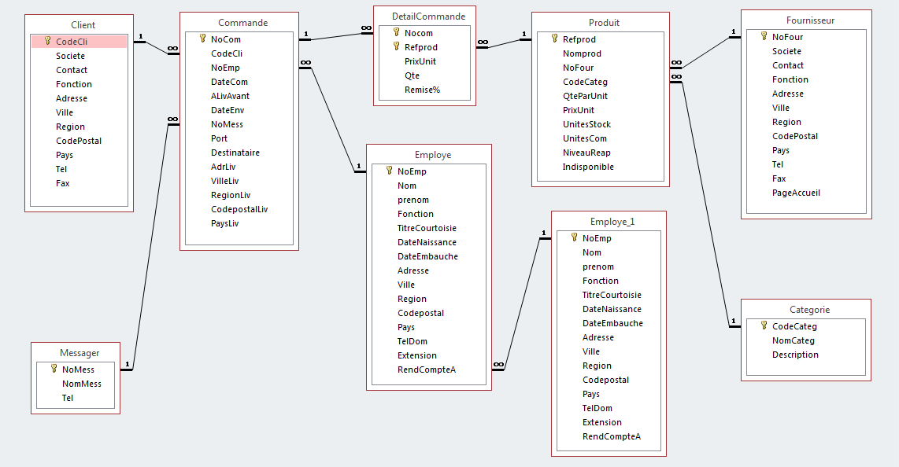

# BD Comptoir 2000

Formats disponibles :

- [MDB](Comptoir2000.mdb) (format original)
- [RData](Comptoir2000.RData)
- [SQLite](Comptoir2000.sqlite)
- TXT
    + [Categorie](txt/Categorie.txt)
    + [Client](txt/Client.txt)
    + [Commande](txt/Commande.txt)
    + [DetailCommande](txt/DetailCommande.txt)
    + [Employe](txt/Employe.txt)
    + [Fournisseur](txt/Fournisseur.txt)
    + [Messager](txt/Messager.txt)
    + [Produit](txt/Produit.txt)
- SAS
    + [Categorie](sas/Categorie.txt)
    + [Client](sas/Client.txt)
    + [Commande](sas/Commande.txt)
    + [DetailCommande](sas/DetailCommande.txt)
    + [Employe](sas/Employe.txt)
    + [Fournisseur](sas/Fournisseur.txt)
    + [Messager](sas/Messager.txt)
    + [Produit](sas/Produit.txt)

