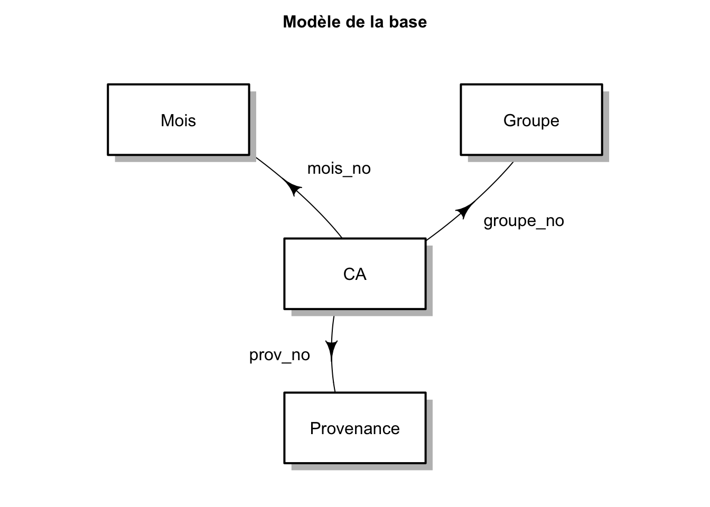

# BD CA

Formats disponibles :

- [MDB](ca.mdb) (format original)
- [json](ca.json)
- [RData](ca.RData)
- [SQLite](ca.sqlite)
- [CSV](csv)
    + [ca](csv/ca.csv)
    + [groupe](csv/groupe.csv)
    + [mois](csv/mois.csv)
    + [provenance](csv/provenance.csv)
- [SAS](sas)
    + [ca](sas/ca.sas7bdat)
    + [groupe](sas/groupe.sas7bdat)
    + [mois](sas/mois.sas7bdat)
    + [provenance](sas/provenance.sas7bdat)

Ce [script R](ca-mdb-to-csv-et-json.R) a permis de passer du MDB à JSON et CSV.